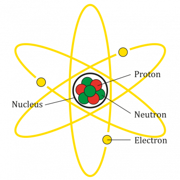
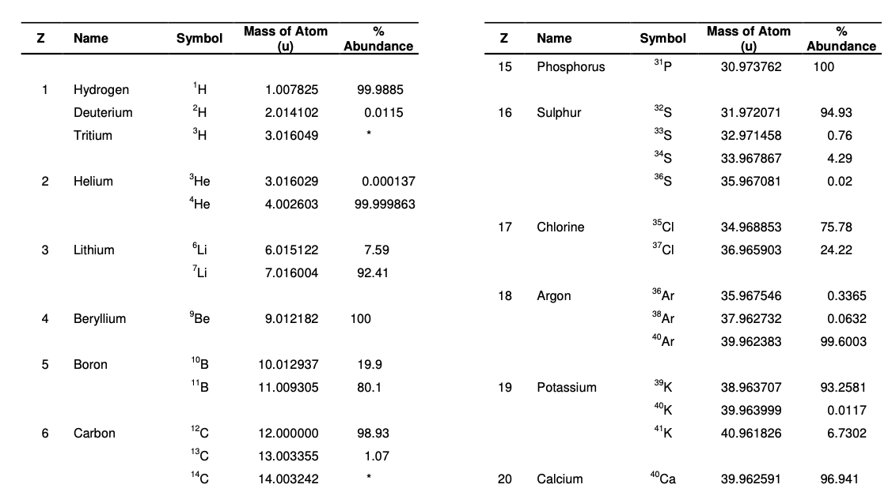

## Plant Cuticle
Cuticle: a hydrophobic boundary layer that coats the outer face of the epidermis of aerial plant organs.

Suberin: a hydrophobic polyester deposited in the apoplast of endodermal and peridermal cells, abscission zones, scar tissues, and seed coats.

Cutin: a polyester network of predominantly fatty acids that constitutes a major component of the plant cuticle.

Cross-link: a lateral covalent linkage between two polymer chains.

Long-chain fatty acid: a fatty acid that is 16 or 18 carbons in length.

Depolymerization: the breakdown of a polymer into its constituent monomers.

Gas chromatography: an analytical technique to separate and quantify the abundance of compounds that are volatile in a gaseous phase.

Apoplast: the continuous region throughout the plant that is external to the plasma membranes.

Dendrimer: a branching, tree-like structure with a single origin and many termini.

Monoacylglycerol: a molecule consisting of glycerol ester-linked to a single acyl chain.

Magic-angle spinning nuclear magnetic resonance (MAS NMR): a method of solid-state NMR spectroscopy that gives improved peak resolution.

Long-chain acyl-CoA synthetase (LACS) proteins: enzymes that conjugate a molecule of coenzyme A to the carboxyl end of a fatty acid.

Cytochrome P450: a large family of enzymes that typically perform oxidation reactions.

Cutinase: an enzyme that hydrolyzes polymeric cutin polymers, breaking the ester linkages.

Epidermal-growth-control theory: the thory that turgor-driven organ growth is constrained by the rigid epidermal layer.

## Mass spectrometry or chromatography

原子量Atomic mass: Relative atomic mass, 原子量的单位为道尔顿Da。而1道尔顿的定义为C12原子静止质量的1/12. 原子核的质子和中子几乎占原子总质量的全部。

同位素isotope：含有相同的质子数不同中子数的原子。包括放射性同位素和稳定同位素。比如C13 和O18就属于稳定同位素。

同位素丰度isotope abundance/Natural abundance：自然界中存在的某一元素的各种同位素的相对含量，比例是固定的。比如在地球上，氧的同位素丰度：16O=99.76%，17O=0.04%，18O=0.20% 
> [同位素丰度表](https://www.chem.ualberta.ca/~massspec/atomic_mass_abund.pdf)

平均质量（average mass ）：计算时候，每个同位素质量都要乘以丰度，然后加和。比如氧气（O2）的平均分子量： 2\*（15.994915\*99.76%+16.999131\*0.038%+17.999159\*0.2%）这里需要说明，大家日常所叫的分子量（molecular weight），大多数时候便是平均质量。

精确质量 （Exact mass）：是以丰度最高的同位素质量进行直接进行加和得到。
{}
使用高分辨质谱进行分析的时，可看到每个同位素峰（isotope peak）.

{}

