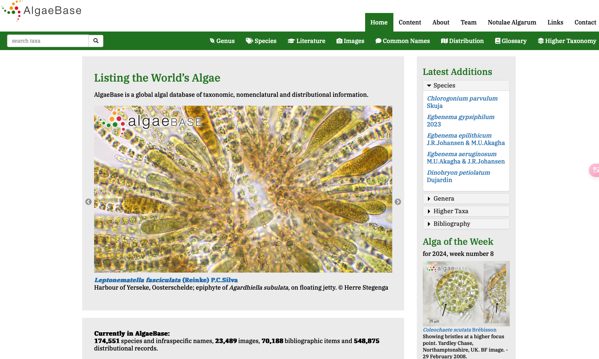
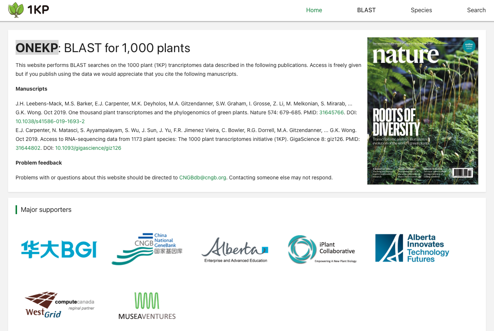
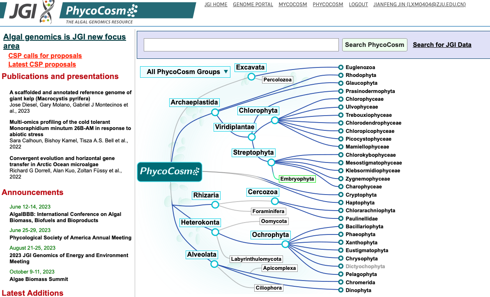
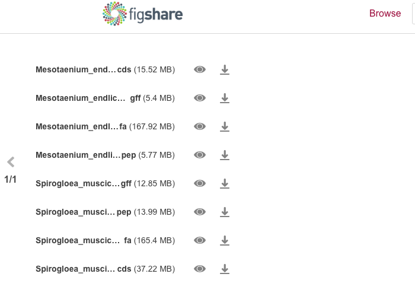
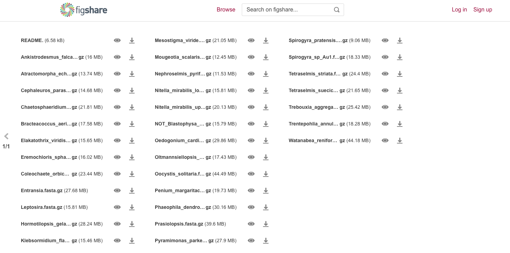
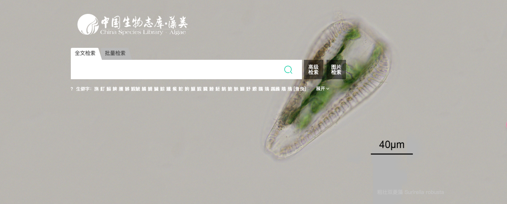

## 藻类数据库：探索藻类的多样性和功能

藻类是一类广泛分布在陆地、淡水和海洋中的光合生物，具有多种形态、结构和代谢特征。藻类在地球生态系统中发挥着重要的作用，不仅是水生食物链的基础，还能够产生氧气、固定碳、调节气候、降低污染、提供生物活性物质等。藻类的研究对于理解生物多样性、进化历史、生态功能、生物技术应用等方面都具有重要的意义。

为了方便藻类的分类、鉴定、分布、生理、遗传、基因组等方面的信息的收集、整理、共享和利用，国内外的研究机构和个人建立了多个藻类数据库，提供了丰富的数据和分析工具，为藻类的研究和应用提供了便利和支持。本文将介绍几个常用的藻类数据库，以及它们的特点和功能。
## AlgaeBase
藻类数据库(AlgaeBase)²是由爱尔兰国立大学的 Michael Guiry 教授和他的团队创建和管理的一个国际性的藻类数据库，包括陆生、海生和淡水生的藻类和开花的海草的信息，也包括一些非藻类的水生植物和真菌的信息。该数据库于1996年开站，目前共收录了13.5万种藻类之种或种下名、1.7万张照片、近5万篇文献、22.3万笔分布资料。该数据库提供了多种检索方式，如按名称、分类、地理、文献等进行检索，也提供了一些专题页面，如藻类的分类系统、命名规则、生物地理、生物多样性、经济利用等。
这个网站有约17万物种，基本上藻类都可以在这上面找到。还有特别多的图片。一般可用来确定藻类所处的分类地位。[网址](https://www.algaebase.org)：https://www.algaebase.org。

## ONEKP
网站包含1000中植物的转录组，包含很多的藻类转录组。[网址](https://db.cngb.org/onekp/)：https://db.cngb.org/onekp/。

## PhycoCosm
Algae基因组资源数据库，具有完整的藻类基因组的数据库 。JGI PhycoCosm是一个藻类比较基因组数据库，由美国能源部联合基因组研究所（JGI）建立和维护，目前整合了100多个藻类基因组、转录组和其他测序数据。该数据库不仅提供了藻类的基因组注释、基因家族、代谢途径等信息，还提供了多种分析工具，可以进行基因组浏览、蛋白质数据比对、注释分析和比较基因组学等交互式分析，探索藻类在不同背景下的数据。该数据库还与其他数据库和平台进行了链接，如NCBI、Phytozome、Ensembl、KEGG、STRING等，方便用户获取更多的相关信息。[网址](https://phycocosm.jgi.doe.gov/phycocosm/home)：https://phycocosm.jgi.doe.gov/phycocosm/home。

## Figshare
这是一个开源的科学数据库，有些发表文章的基因组或者转录组数据在此数据库。比如藻类的数据。
这篇文章测序的两个藻类基因组就传到了这个数据库。
[Genomes_of_subaerial_Zygnematophyceae_provide_insights_into_land_plant_evolution](https://figshare.com/articles/dataset/Genomes_of_subaerial_Zygnematophyceae_provide_insights_into_land_plant_evolution/9911876/1)。

这篇文章测了33个藻类转录组，也全部上传到了这个数据库。
[Green algal transcriptomes for phylogenetics and comparative genomics](https://figshare.com/articles/dataset/Green_algal_transcriptomes_for_phylogenetics_and_comparative_genomics/1604778)

## 中国生物志库·藻类

中国生物志库·藻类是由中国科学院武汉文献情报中心建立和维护的一个综合性的藻类数据库，包括淡水藻和海藻两个子库，收录了中国境内的藻类物种的中文名、拉丁名、形态特征、分布、生境、文献、图片等信息，目前已经完成了常见的两百余种藻类的形态信息整理和发布。该数据库不仅提供了藻类在线搜索查询功能，也是实现人工智能图像识别的基础资源，为藻类的生物监测和水环境评价提供了技术支持。

该网站需要购买权限才能够查看完整内容，但是对于检索是免费的。最大的有点是有中文翻译后的名字，不用网上乱搜。[网址](https://species.sciencereading.cn/biology/v/botanyIndex/122/ZLZK.html)：https://species.sciencereading.cn/biology/v/botanyIndex/122/ZLZK.html

