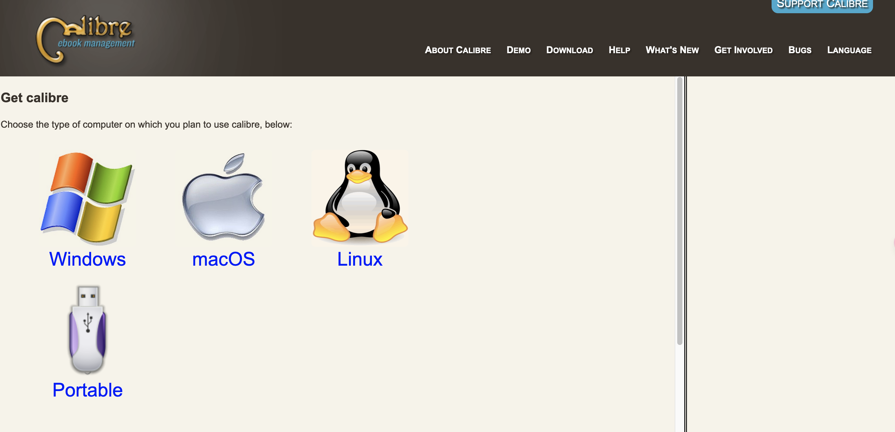

# 下载安装
在[calibre官网](https://calibre-ebook.com/download)下载安装对应版本的软件

安装后打开的界面

# 设置kindle推送相关参数
打开首选项，点击sharing by email

设置邮件，收件是kindle相关邮箱，可以在kindle设备上查看。另一个发件邮箱，推荐有gmail和outlook。设置后点击apply。

# 发送书籍至kindle
选中图书，点击右键，直到选择`Email to xxxxx@kindle.cn`刚填写的kindle邮箱，点击后会开始发送，过一段时间就可以在kindle上看到有新书出现。
