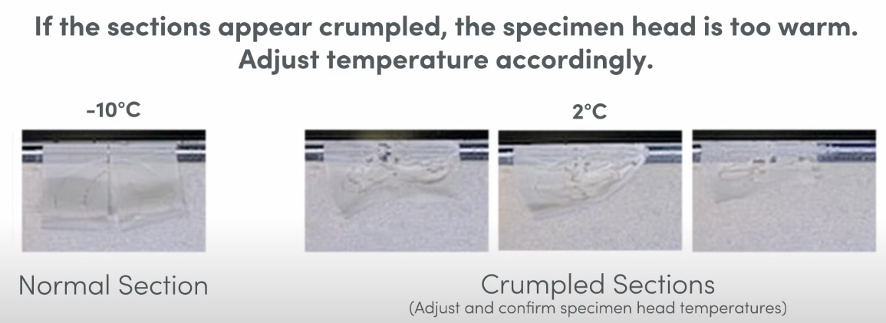

## What exactly is cryosection?

Frozen section technique is a valuable tool to rapidly prepare slides from tissue for microscopic interpretation. 
***
## 植物冷冻切片优缺点
### 缺点
- 易形成冰晶，破坏组织结构
    与动物组织相比，植物组织样品含水含量跟高，制作冷冻切片时，难度更大。在进行低温冷冻时，会有更多的冰晶形成，冰晶体积大于液态水，从而破坏组织细胞结构。
- 冰冻易破碎
    植物细胞有细胞壁，冰冻后硬度变大易破碎，使得切片破裂不完整。

### 优点
- 操作快速简便
    不需要经过脱水、透明、浸蜡等石蜡切片过程步骤，使得制片时间大大缩短。
- 组织以保持原始状态
    新鲜组织可以直接冷冻，能够较好保持组织原始结构状态。
***
## 如何冷冻植物样品？
为了更好地保持植物组织原有的结构状态，样本需要尽可能的快速冷冻。常用的冷冻剂包括：液氮(-190°C)和干冰（-70°C）通常最好的冷冻剂需要快速冷冻，液氮是比较好的选择，但组织与液氮存在很大温差，容易导致组织表面沸腾，使组织周围容易产生空泡或冷冻不均匀，最终使得组织破裂和损伤组织。

冷冻保护剂的使用，可以使植物组织不直接接触液氮也可快速冷冻，很好解决了液氮直接冷冻导致的样品破裂或结构改变。

常用的商用冷冻剂包括hexane, 2-methylbutane, and 1-methoxyheptafluoropropane (N7000)。 前面两者有毒或者易燃，会对人体造成伤害。而3M Novec 7000 Engineered liquid具有很好的导热性，无毒，不挥发且具有热稳定性，同时也能同等程度或者更好的保护组织结构。
***

## 冷冻方法
### 液氮和冷冻剂联合冷冻法
- 液氮罐中倒入液氮，液氮液面不要太高，避免进入金属烧杯与异戊烷混合。
- 金属烧杯倒入异戊烷，将金属烧杯置于液氮中预冷至无雾气，可能需要15 min左右。
- 准备新鲜的组织，吸取表面多余的水分，用forcep或spatula将组织完全浸没到异戊烷，冷冻几分钟，具体时间还需根据组织类型和大小来确定。
- 冷冻结束后，将冷冻组织立即转移至冷冻保存管，置于干冰上。可以进行下一步切片或者放至-80°C冰箱保存待用。

### 干冰和丙酮acetone
- 1 L玻璃烧杯中加入粉状干冰，大概3-5 cm厚度。
- 100 ml玻璃烧杯放入植物组织，将烧杯放至干冰上，部分淹没至干冰中。
- 向干冰中加入丙酮，加速温度传导，从而冰冻组织。
***
## 包埋组织块
包埋可以和冷冻同时进行，也可以分开进行。
### 先冷冻后包埋
- 冰浴预冷冷冻包埋剂OCT至少30 min。
- 金属镊子、金属刀片以及冷冻管至于粉末干冰上，预冷备用。
- 包埋模具需要先标记好样品方向，因为OCT会很快冷冻变白，分辨不了方向。
- 在模具底部挤上OCT，然后取出-80°C的冷冻组织，将其放置到模具上再覆盖上OCT，使OCT完全包埋住样品（整个过程在粉末干冰上进行）。
> OCT包埋过程中，尽量去除与组织之间的气泡。
- OCT完全冷冻后，从模具中取出包埋块，用刀片修剪多余的OCT。
- 将包埋块放入冷冻管，保存于-80°C。
### 冷冻包埋同时进行
- 准备异戊烷液氮浴。
- 准备fresh tissue，吸取多余的水分。
- 冷冻模具标记好组织方向，OCT快速冷冻变白后，很难确认组织方向。
- 在培养皿中，室温OCT小心涂至新鲜样品表面，确保没有气泡。
- 将涂有OCT的样品转移至适合大小的冷冻模具中，继续添加OCT填充模具，确保组织被OCT完全覆盖，确认没有气泡形成。
- 将冷冻模具放入异戊烷中，浸入部分模具，直至OCT完全变白。
- 从冷冻模具中取出组织块，用刀片修剪后，放入冷冻管（提前置于干冰预冷）。
> 如果不使用密闭容器保存组织块，可能会脱水并损坏组织块。
- 组织块可以长期保存在-80°C或者立刻进行切片。
***
## 冷冻切片cryosection
### 仪器工具预冷
- 冷冻切片机退出睡眠模式，开始制冷。
- 大部分组织，样品头温度调整至-10°C；刀片温度调整至-20°C；大部分组织切片厚度10 µM左右。
- 将载玻片提前放置切片机，至少冷却30 min（如果不提前放，切片一放置玻片会立即融化）。
- 将OCT包埋块放至冷冻切片机恒冷室30 min，使其温度恢复至恒冷室温度。
> 如果温度过低，可能会导致切片破裂。如果温度过高，会导致切片压缩，皱缩。
- 载玻片邮寄容器放至低温恒冷室中冷却。
### 组织块固定
- 室温OCT填充至金属specimen stage表面。
- 将组织块拿出来放至到样本台。
- 将金属样本台和组织块一同放至冷冻切片机cryobar上进行冷冻。
- OCT彻底冷冻变白后，就将组织块固定到样本台，准备切片。
### 冷冻切片
- 将样本台固定到切片机位置，先切掉多余的OCT，直至可看到整块组织的截面。
- 组织切片大小需要和载玻片相适配，如果组织大小已经超过了载玻片的大小，可用预冷的刀片切一下组织。
- 准备切片，切片的速度需要根据厚度和组织来决定。较硬和较厚的切片需要low sectioning speeds。此外，不同温度会导致切片碎裂。
    - 样本头温度过低，可能会导致切片撕裂，需要适当调高温度。
    
    - 如果切片出现卷拢，则说明可能样本头温度过高，需要调低温度。
    
- 用载玻片吸附切片，并将手贴在切片区域的背面，帮助切片完全的吸附至载玻片。整个过程都在冷冻室进行。
- 将制作好的冷冻切片放入预冷的载玻片邮寄夹，密封保存，并置于干冰上，转移至-80°C保存，通常可以保存4周以上。
> 每个邮寄器尽量放一个切片，防止互相交叉污染，并且需要放在密闭的容器内保存。运输冷冻切片务必在有干冰的条件下运输，切勿放在常温条件。
- 最后，将切片头上的金属样品台和组织块取下，放置冷冻区域，并用OCT覆盖裸露的组织，等待OCT冷冻后，刀片修剪多余的OCT，将组织块放入冷冻管，置于干冰上转移至-80°C长期保存。

## 参考资料
1. [高冷冻切片的技术水平 \- 知乎](https://zhuanlan.zhihu.com/p/30836581)
2. [Visium Tissue Preparation Protocol \| Flash Freezing Tissue](https://www.youtube.com/watch?v=KdfqH4zoy5M&list=PLfaSRwcfHcq0D8RTy9LR8sKsWcF6C8TAt)
3. [Bradshaw R (2023) MALDI MS Imaging of Cucumbers. In LM Cole, MR Clench, eds, Imaging Mass Spectrometry: Methods and Protocols. Springer US, New York, NY, pp 63–69](https://doi.org/10.1007/978-1-0716-3319-9_6)
4. [Nunez V, Cook A, Havnar C, Flanagan S, Ge N, Martzall A, Taylor RE, Lu M, Mayba O, Foreman O (2022) Tissue cryopreservation using the 3M™ Novec™ 7000 freezing coolant offers a comparable and safe alternative to customary coolants. Journal of Histotechnology 45: 85–91](https://doi.org/10.1080/01478885.2021.1993528)
