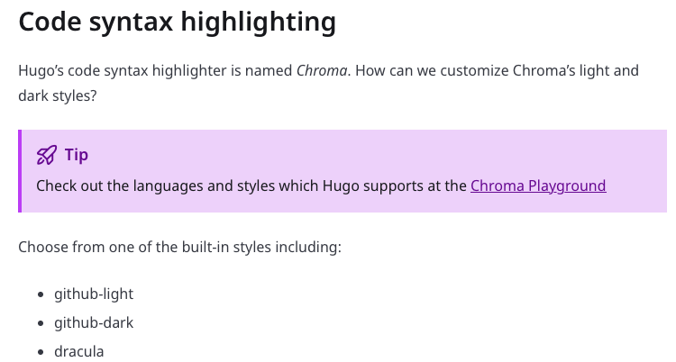
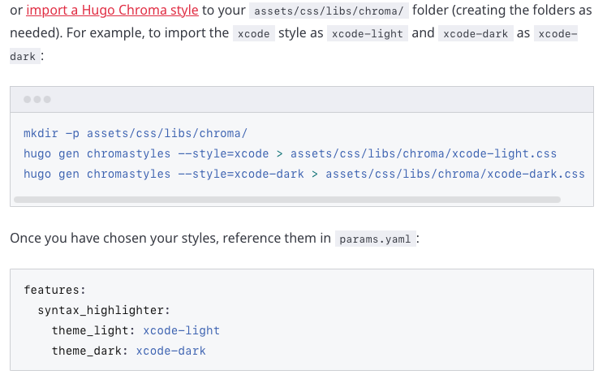
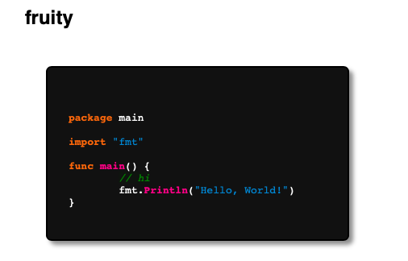
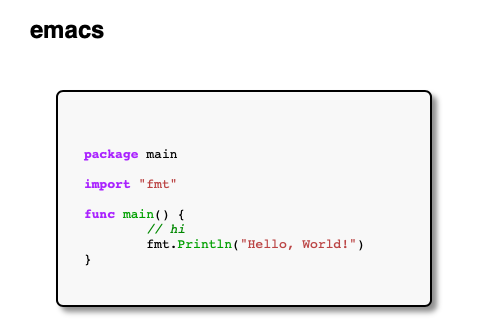

# <font color=green>Code syntax highlighting</font>
According to [Hugo blox Docs site](https://docs.hugoblox.com/getting-started/customize/), you can set your code syntax highlight style.



There are many hugo chroma styles on [this site](https://xyproto.github.io/splash/docs/all.html).



You can download style by following code：
```shell
# Make directory named chroma for save sytle css files
mkdir -p assets/css/libs/chroma/
# Generate style css file, such as xcode highlight style. you can rename as xcode-light.css
hugo gen chromastyles --style=xcode > assets/css/libs/chroma/xcode-light.css
```