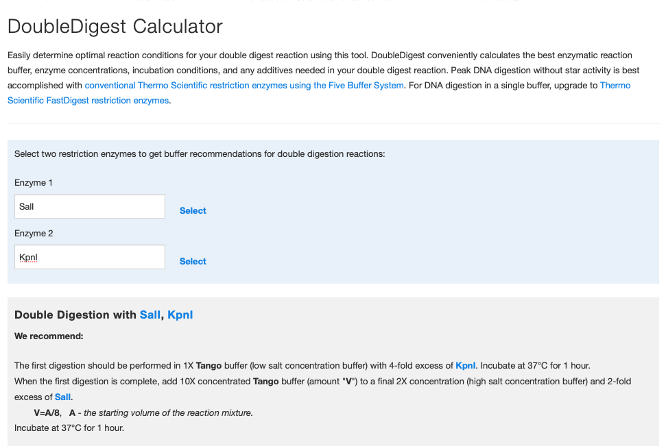

## 1. LIPID MAPS网站
[LIPID MAPS网站.](https://www.lipidmaps.org)。文献介绍：[LIPID MAPS: update to databases and tools for the lipidomics community.](https://academic.oup.com/nar/advance-article/doi/10.1093/nar/gkad896/7321986?login=true) 

<embed src="LIPIDMAPS.pdf" width="700" height="650">

## 2. 赛默飞双酶切（慢酶）体系计算网页工具
网站地址：[DoubleDigest Calculator](https://www.thermofisher.cn/cn/zh/home/brands/thermo-scientific/molecular-biology/thermo-scientific-restriction-modifying-enzymes/restriction-enzymes-thermo-scientific/double-digest-calculator-thermo-scientific.html)。使用很简单，输入两个内切酶就会出现结果。
