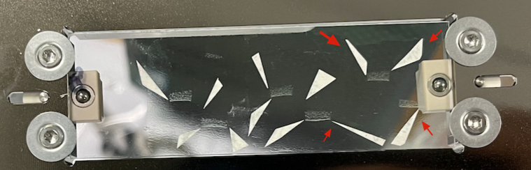
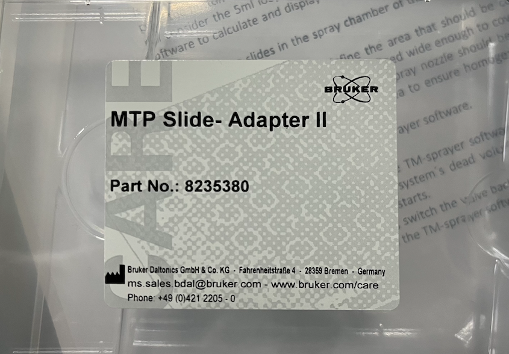
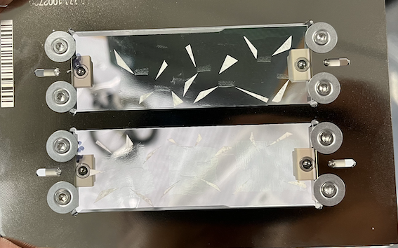
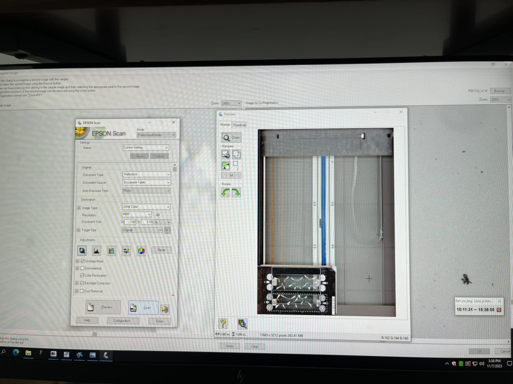
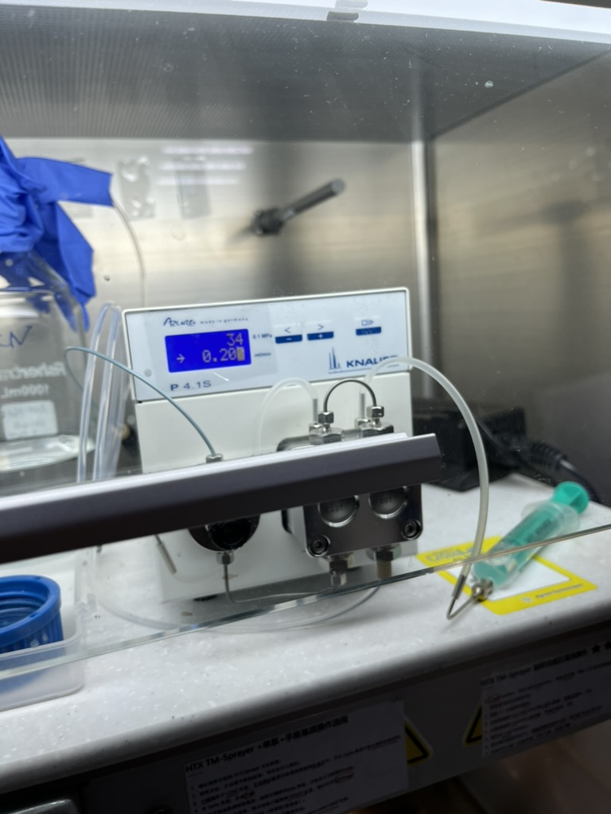

## Cryo-section slides dry
30 µm thin sections of tomato MG fruit pericarp were mounted on indium tin oxide coated glass slides. Then slides wrapped in tin foil were vacuum dried for 15 min by . Bright field microscopic images were acquired EPSON Scan in 4800 dpi. 
## DHB matrix spray
150 mg of DHB were dissolved in 10 ml acetonitrile/water (7:3, v/v) with 0.1 % trifluoroacetic acid. The matrix was applied by a TM-Sprayer (HTX Imaging) with 40 mm nozzle height, 10 psi nitrogen pressure, 75 °C, 0.1 mL/min solvent flow, 1200 mm/min z-arm velocity, 8 passes, a CC moving pattern, 3 mm track spacing, and 0 s drying time.
## HCCA matrix spray
100 mg of HCCA were dissolved in 10 ml acetonitrile/water (7:3, v/v) with 0.2 % trifluoroacetic acid. The matrix was applied by a TM-Sprayer (HTX Imaging) with 40 mm nozzle height, 10 psi nitrogen pressure, 75 °C, 0.12 mL/min solvent flow, 1200 mm/min z-arm velocity, 4 passes, a CC moving pattern, 3 mm track spacing, and 30 s drying time.
## 定位样品在载玻片上的位置
{}
为了防止基质喷撒覆盖后，导致无法找到样品位置。
{}
1. 切片完成并真空干燥后，我们需要用到微小的标签纸来定位样品。红色箭头的白色三角片，需要自己裁剪并贴到样品周围，并且这些三角贴纸尽可能剪的尖锐一点，并且形状有差异，方便后续分析。

2. 然后将载玻片定位到Bruker MTP Slide-Adapter II的上面，一块板可以夹两个ITO载玻片。

1. 将固定好的载玻片用扫描仪记录下来，最后需要用来定位样品。

## Manipulate TM-Sprayer(HTXImaging) 
1. 打开机器背后右上角的电源开关，再打开机器右边灯的开关。
2. 机器前面左上角绿色数字显示为喷嘴工作温度。调节这个温度需要在连接仪器的电脑软件想上操作进行修改，可以看到电脑左上角有“Sample，cycle，temperature”三个标签，其中temperature温度标签就是用来调节喷头温度的。

3. 温度下边是压力显示表，通常打开仪器应该没有压力，且下面的指示灯会闪烁，表示没有压力，需要打开普氮阀门对其进行加压。一旦压力产生，指示灯应该熄灭，且调节泵一般显示压力数值是34左右，使其稳定。

4. 然后将仪器左下角的旋钮调节至Load位置。

5. 机器上方有压力和流速泵，长按最右边按钮可以开机，短按一下暂停工作。显示器数值34代表压力，普氮阀门打开后，压力比较容易稳定，然后调节流速（可能在0.3-0.5之间，显示屏右边有“-”和“+”可以调节流速。流速左边还有个箭头，表示正在工作中，大概工作15min，排除其中的空气。如果空气比较多，则可以用右下角绿色的注射器进行手动拍空气。

6. 显示屏最下方蓝色的长条为喷基质的工作程序，其中包含“文件名、作者、基质名、溶剂名、工作温度、重复喷次数、基质浓度、基质流速、velocity喷嘴移动速度、track spacing、移动模式、压力、气体流速、每次喷洒后干燥时间”等参数，包括基质本身参数和喷嘴工作模式。

7. HTXImaging软件左上角选择sample，可以设置样品空间位置信息，是二维信息（X轴和Y轴），确定好坐标范围，也就是一个矩形。然后会在左上角标签“cycle”界面，软件会大概计算出一个所需基质的总体系。

8. 确定六通阀的阀门转到Load位置，然后从六通阀的进样口注射5 ml左右的基质缓冲液，将线圈中的死体积尽可能排出，然后开始注入需要喷的基质。基质的体积根据step7中的体积来决定，可以适当多注入多一点的基质，使其充满定量环。

9. 此时，手动调节机器上方泵的流速（参照step中设置的程序进行调整）。然后在cycle界面设定好基质体积，在开始界面点击开始，最后等到工作温度达到设定温度，将六通阀切换至SPRAY位置，点击continue，会有一个“wait time remaining”，等这个结束，sprayer开始全自动工作。
 

10. 待喷基质工作完成，切换六通阀到LOAD位置，点击电脑上软件“confirm valve LOAD”完成，然后按清洗流程开始执行操作。
