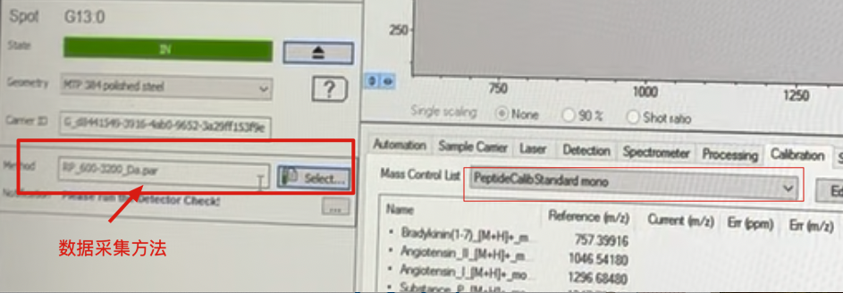

## MALDI开始前工作
在样品ITO玻璃板上未喷基质处点标准品（1 ul 多肽标准品和1 ul HCCA matrix混合），通风橱晾干后会自然结晶。用于调教系统及方法。

## 找到校正方法文件并复制到自己的实验文件夹
每次实验不改原始方法文件，复制到自己文件夹再进行修改。选择`D/Methods/flexControlMethods/RP_600-3200_Da.par`, 复制到自己的新建实验文件夹。

## 切换到上述方法
- 打开flexControl软件，然后file——select Method，选择方法par文件，一般采集方法需要和相应的标准品相匹配。
- 等待有下角的状态由黄变为绿，说明方法载入成功。

## 校正仪器，确保测量精度
选择Calibration——Peptidecalibstandard mono（适合m/z 700-4000之间），然后标准品会出现在`Ref.Mass/Da`列里面。

## 采集标准品的质谱图
- 视野中找到Standard样品，点状白色的结晶就是标准品和matrix的混合物。

- 十字中心点调至白色样品处，点击`Start`开始开始采集标准品质谱图。瞬间旁边会出现质谱图。

- 点击`Automatic assign`,自动对齐标准品和list理论值的峰图，只要Err在正负10之间就说明仪器正常。

## 保存校正后的方法
- 点击`Apply`
- File——Save method

## 然后选择图像采集方法
- 复制图像采集方法`Imaging_Lipid_20µm.par`到自己文件夹
- 载入该图像采集方法

- 找到样品，先采集一针，根据丰度，可以调整激光强度。10^5左右的intensity就差不多。

- 然后保存方法。

## 设置采集分辨率
- 一般根据你的需要进行调整，分辨率越高，采集时间越久。也就是两次激光距离越短，激光次数越多。

- 再次保存方法。

## 然后打开图像采集软件——fleximaging
- 打开软件，按右边的步骤一步步进行下去

- 选择new imaging run，点击ok

- 命名和选择结果保存文件夹

- 设置分辨率，和优化过的方法文件

- 选择baseline

- 将之前扫描的样品位置照片放置此次实验文件夹下面，这样才能在这一步识别。否则不会出现。

这样是出现正常的

- 需要对齐flexControl和flexImaging，使得两边的位置一致，这样才能采集到正确的图。一般需要对应3-4个点。

MTP板子放入机器前，需要在盖子上做好标记，这样能和flexcontrol软件的384个圆点进行对应，根据点击圆点坐标（C9，定位到相应的位置），较为快速的定位样品所在位置。

- 用矩形工具或者无规则工具将需要采集的样品框起来。需要采集几个就框几个。

- 然后开始run，点击确定就可以，此时可能会卡顿，耐心等待。

- 可以看到采集所需要的时间。分辨率高，且样品数多，就会需要几个小时，甚至几天的时间。

- 可以停止，进行调整，然后再次run

## 数据分析
- 使用SCiLS Lab软件进行数据分析，首先打开软件。

- 选择new，然后选择TOF,然后next

- 添加flexImaging采集的`.mis`数据文件。

- 数据转换

出现样品的轮廓图

- Next后，会出现总的图谱

- 然后`Import`，选择文件夹存放，然后开始走进度条。

- 进度条结束后，就会出现这样的界面。可以选择你感兴趣的m/z。

