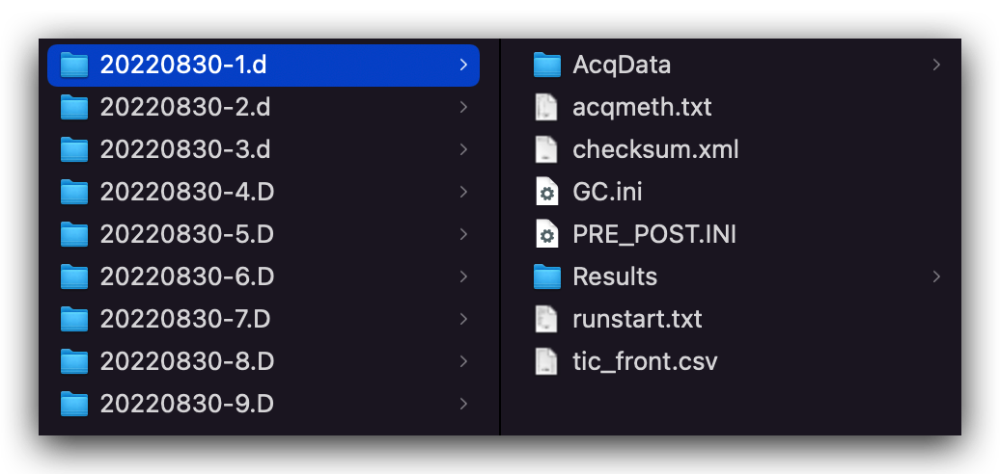
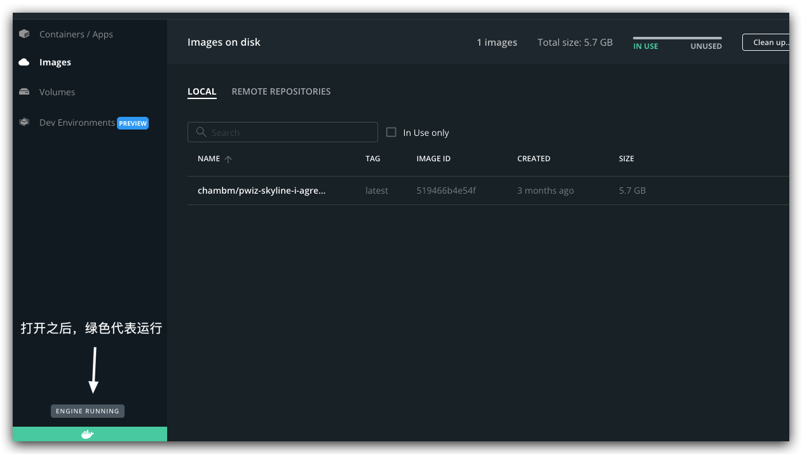
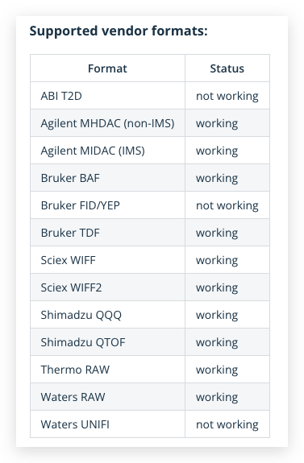

# <font color=seagreen>msconvert</font>

[msconvert](https://proteowizard.sourceforge.io/tools/msconvert.html)是一个命令行工具。在windows系统中，已经开发出了交互界面的软件， 对用户来说容易上手；在MacOS和Linux中，它依旧是个命令行工具，用户不友好，用起来比较麻烦。

Windows用户可以下载打包好的软件，[proteowizard官方网站](https://proteowizard.sourceforge.io/download.html)。在网站下载页面可以下载不同版本的，64位或32位，其中32位的可以支持msconvert支持的所有平台厂商格式，而64位不支持T2D格式。此外，还有MacOS和Linux用户的版本，但是据反馈用起来还是略显麻烦。


# <font color=seagreen>Supported vendor format</font>

据msconvert网站介绍，目前支持7大主流的厂商平台质谱数据格式，下图可以看到各厂商的数据格式。


目前，我们实验室主要是Agilent平台的数据格式`.d`，这个格式与其他格式相比，会更麻烦点，因为它是个文件夹，可以继续点击进入看到包含的文件，会给批量转换带来一定的不便。

所幸的是，有大牛借助docker，将msconvert打包成一个镜像文件，方便在各平台使用，尤其是帮助Mac和Linux用户。镜像名字[proteowizard/pwiz\-skyline\-i\-agree\-to\-the\-vendor\-licenses](https://hub.docker.com/r/proteowizard/pwiz-skyline-i-agree-to-the-vendor-licenses)。对于Mac用户的我来说，正合我意，接下来一步步仔细讲解改镜像的用法！



# <font color=seagreen>如何使用Docker</font>

首先，我们需要从[docker官网](https://hub.docker.com/)下载docker客户端。安装之后，运行docker。Docker你可以注册一个账号，如果需要自己打包docker镜像和分发。



然后，在命令行输入一下命令，下载`chambm/pwiz-skyline-i-agree-to-the-vendor-licenses`镜像。这个文件比较大，大概在5.7G，有点心痛自己的250 G的Mac存储空间。

```
docker pull chambm/pwiz-skyline-i-agree-to-the-vendor-licenses
```

# <font color=seagreen>如何使用docker image</font>

我们可以在image页面[chambm/pwiz\-skyline\-i\-agree\-to\-the\-vendor\-licenses \- Docker Image \| Docker Hub](https://hub.docker.com/r/chambm/pwiz-skyline-i-agree-to-the-vendor-licenses)，看到这个image支持转换的格式种类，多达10种，基本上能够满足需要，而我目前只需要用到Agilent。



msconvert转化格式命令行：

```
docker run -it --rm -e WINEDEBUG=-all -v /your/data:/data chambm/pwiz-skyline-i-agree-to-the-vendor-licenses wine msconvert /data/file.raw
```

如果不理解参数，可以用help选项来查看帮助文档,命令如下：

```
docker run -it --rm chambm/pwiz-skyline-i-agree-to-the-vendor-licenses wine msconvert --help
```

运行结果，image部分参数解释。

```
Options:
  -f [ --filelist ] arg              : specify text file containing filenames
  -o [ --outdir ] arg (=.)           : set output directory ('-' for stdout)
                                     [.]
  -c [ --config ] arg                : configuration file (optionName=value)
  --outfile arg                      : Override the name of output file.
  -e [ --ext ] arg                   : set extension for output files
                                     [mzML|mzXML|mgf|txt|mz5]
  --mzML                             : write mzML format [default]
  --mzXML                            : write mzXML format
  --mz5                              : write mz5 format
  --mgf                              : write Mascot generic format
  --text                             : write ProteoWizard internal text format
  --ms1                              : write MS1 format
  --cms1                             : write CMS1 format
  --ms2                              : write MS2 format
  --cms2                             : write CMS2 format
```

# <font color=seagreen>Agilent`.d`转换举例</font>

安捷伦数据麻烦的点在于，它是一个文件夹，你很够打开，发现里面有很多文件，这给我们批量转换带来了难度。搜索资料后，发现已经有博主已经提到了这个问题。博客地址：[Use msconvert in Linux or Mac \- Miao Yu \| 于淼](https://yufree.cn/en/2019/10/15/use-msconvert-in-linux-or-mac/)。我基本上在他的基础上进行略微的改动，并更详细的说明各参数的意思，方便大家操作。<font color=red>看着简单一行代码，在过程中着实出现了很多问题，费老大劲儿才顺利运行</font>。

写一个shell脚本，for循环用于批量读取MS数据，并进行转换。具体过程如下：

```shell
# 选择一个目录，然后新建一个文档
cd
touch dockermsconvert.sh
# 赋予755权限，使其可以执行。需要一点linux基础，才能理解
sudo chmod 755 dockermsconvert.sh
# 打开并编辑文档，输入以下文件内容，保存后是一个shell脚本，可在linux终端运行。“#!/bin/zsh”是shell脚本的格式。
#!/bin/zsh 
for f in $(basename /yourdatapath/*.*)
do
  docker run -it --rm -e WINEDEBUG=-all -v /yourdatapath:/data  chambm/pwiz-skyline-i-agree-to-the-vendor-licenses wine msconvert $f
done

# 打开.zshrc或者.bashrc，设置环境变量，使其能够全局运行
vim .zshrc
source .zshrc
# 运行shell脚本
sh dockermsconvert.sh
```

<font color=purple>dockermsconvert.sh</font>具体内容解释：
`#!/bin/zsh`: shell语言的默认格式。
`for f in $(basename /yourdatapath/*.*)`：利用for循环，来逐一读取你的文件夹下面的`xxx-1.d`文件，赋值给f。`*.*`匹配你所有的文件夹下面的数据名称。
`do……done`: 执行docker命令行。
`docker run -it --rm -e WINEDEBUG=-all`：这部分是docker命令部分参数。`-it`：用来生成容器的选项；`--rm`：在运行结束后，清除容器；`-e`:设置环境变量；`WINEDEBUG=-all`：避免出现表示运行过程信息及警告信息。
`-v /yourdatapath:/data  chambm/pwiz-skyline-i-agree-to-the-vendor-licenses wine msconvert $f`：这部分是image的参数。`-v`：出现image运行过程的信息；`/yourdatapath:/data`：冒号前面部分是你数据所在文件夹的绝对路径，冒号后面的就是pwiz映射的文件夹，相当于映射到你当前的文件夹；`wine msconvert`：相当于运行msconvert；`$f`：指for循环中f，代表文件名，需要转换格式的文件。

至此，你已经成功在Mac或者Linux上完成了rawdata格式的转换，可进行下一步的分析。

# <font color=seagreen>参考内容</font>

1. [Docker run 参数详解 \| Docker\-guide](https://jiajially.gitbooks.io/dockerguide/content/chapter_fastlearn/docker_run/index.html)
2. [Use msconvert in Linux or Mac \- Miao Yu \| 于淼](https://yufree.cn/en/2019/10/15/use-msconvert-in-linux-or-mac/)
3. [chambm/pwiz\-skyline\-i\-agree\-to\-the\-vendor\-licenses \- Docker Image \| Docker Hub](https://hub.docker.com/r/chambm/pwiz-skyline-i-agree-to-the-vendor-licenses)