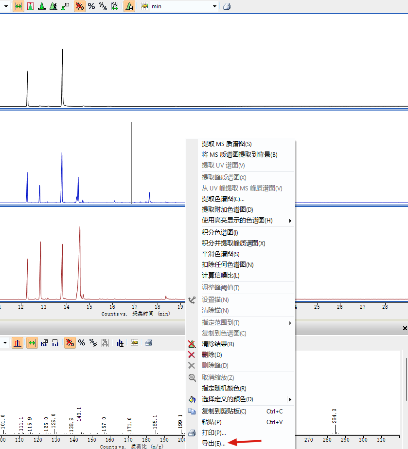

# 导出需要的TIC
点击选中——右键——导出。

选择`emf`文件格式，可选择高亮或者所有色谱图。

# 用Adobe Illustrator (Ai)打开文件
整个图像是一个group，可以看到y轴数字显示有点问题。

右边图层点开，Group下面还有Clip Group，path，以及x轴title。ClipGroup就是剪切组合，它含有蒙版和对象。

Clipgroup下面还包含剪切路径以及很多对象

# 开始处理图片
## Step1 去除所有剪切蒙版和取消组合
选中图片——file——scripts——`RemoveClippingMasks`

弹出确认对话框，所有clippingmask都删除了。

此时，右侧图层中，所有的Clip字样消失了，只有Group。

{}
[RemoveClippingMasks](https://github.com/nvkelso/illustrator-scripts/blob/master/import/RemoveClippingMasks.jsx)是一个自动化脚本或者称它为插件，可以一键除去所有clippingmask，便于后续操作。它是github上一个作者写的，可以将文件下载并导入到Ai中使用。
{}

## Step2 ungroup第一层次的group，释放图片的各个部分
选中图片——ungroup，可以看到第一层的group不见了，剩下几个小group。

删除几个空白路径和第一个Group，一个一个删除，前提不影响图片。

至此就剩下图片主题部分，然后根据图片修改相应部分。

## Step3 XY轴调整
将文字和路径各自组合成一个Group

锁定其他几个含有文字的图层，然后Select——All object——All text object，这样就选中了所有Y轴的文字，然后group，这样可以整体调整Y轴文字。

然后调整Y轴，包括tick加粗

同样的方法调整X轴

## Step4 删除图片黑框,修改文字

