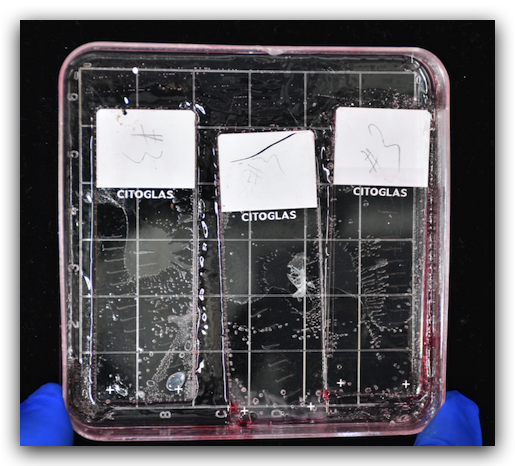

## 一、固定

取新鲜的植株材料，用 ddH2O 清洗干净，放入FAA 固定液(100 mlFAA：5 ml福尔马林(5%)+5 ml冰醋酸(5%)+90 ml 70%或者50%的ethanol溶液(63%或45%)，固定过夜(8 h以上)。若样品漂浮在固定液表面，则抽真空，每次10 min，反复3~4 次，直至材料沉没在固定液中。抽真空后更换一次新鮮的固定液。

## 二、脱水

用 70%的乙醇溶液将固定好的植物材料清洗3-4次，除去残留在組织内的固定液及其结晶沉淀。为避免材料的急剧收缩，按以下顺序对材料进行乙醇浓度梯度逐级脱水：70%——85%——95%——100%——100%，每步至少1 h。

## 三、透明化

以二甲苯作为透明剂，替换出植物组织体内的乙醇。按以下顺序对材料进行逐级透明化：无水乙醇/二甲苯(1:1)——二甲苯——二甲苯，每步至少1.5 h，可根据组织大小适当延长透明时间，直至组织完全透明。

## 四、浸蜡

用石蜡取代透明剂 ，使石蜡浸入植物组织内。按以下顺序对材料进行浸蜡：二甲苯/石蜡(1:1)——石蜡——石蜡，其中二甲苯/石蜡(1:1)一步可过夜(8 h以上)，每次纯石蜡浸渍至少3 h。

## 五、包埋

将已融化的纯石蜡倾倒入准备好的锡纸模具中，用加热过的镊子将材料放入模具中，使其完全浸没于石蜡中，冷却后，放入4°C冰箱中备用。

## 六、切片、展片

1. 将包埋有材料的蜡块固定在石蜡切片机(Leica，Modell RM2135)上，用刀片将蜡块修成梯形，在果皮材料周围各留约2mm。切片的厚度为至少10 µm， 并在显微镜下观察蜡带以決定取舍。
{}
修块要修整齐，否则容易使切片切歪，不够直。
{} 

2. 将ddH2O滴加在涂有多聚赖氨酸的载玻片上，把蜡带的反面漂浮其上并放在烫板上展片(展片机提前设置为42°C) 。待蜡带完全展开后，吸去多余的水，在烫板上干燥过夜。

##  七、染色

1. 除蜡：二甲苯（15 min）——二甲苯（15 min）——二甲苯：乙醇（1:1，10 min）——100% ethanol（5 min）——100% ethanol（5 min）——95% ethanol（5 min）——85% ethanol（5 min）——70% ethanol（5 min）——50% ethanol （5 min）——ddH2O（5 min）。

{}
脱蜡务必使用专用的染缸，防止二甲苯和塑料反应，使载玻片和器皿紧紧粘在一起，导致无法正常在显微镜观察。
{}

2. 苏丹红IV配制。母液stock solution: 0.1% w/v in isopropyl alcohol（0.03 g苏丹红IV + 30 ml异丙醇 ）；按母液/H2O（3:2，即30 ml stock solution + 20 ml ddH2O）的方式将其稀释为工作液。充分混匀后，室温静置30 min，然后注射器过滤去除沉淀。
3. 染色：染液添加到切片上，染色10 min-30 min（根据切片材料调整）。
4. 除去多余染液：用50%异丙醇洗一次，ddH2O洗一次，最后加水盖上盖玻片，立即观察拍照。（或者乙醇梯度：70% 1 min——85% 1 min——95% 1 min——100% 2 min——100% 2 min——二甲苯：乙醇（1:1，3 min）——二甲苯 3 min）
5. 显微镜观察拍照。

## Reference

Girard A-L, Mounet F, Lemaire-Chamley M, Gaillard C, Elmorjani K, Vivancos J, Runavot J-L, Quemener B, Petit J, Germain V, et al. (2012). Tomato GDSL1 Is Required for Cutin Deposition in the Fruit Cuticle. The Plant Cell 24: 3119–3134.