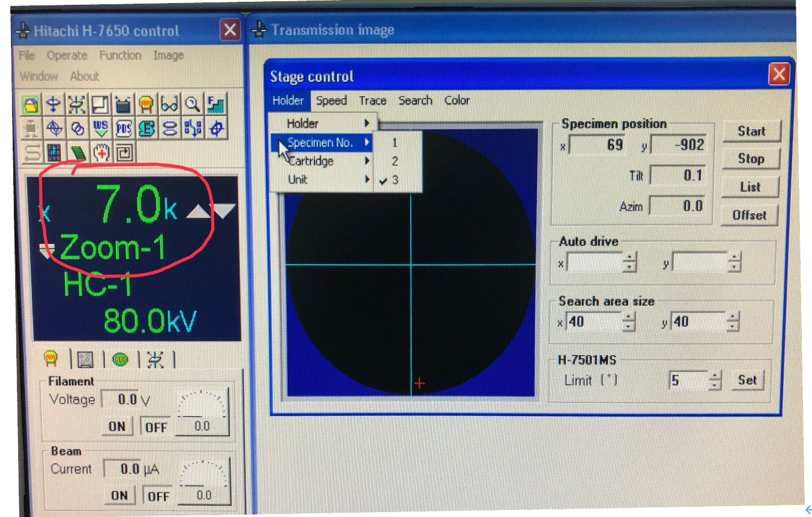
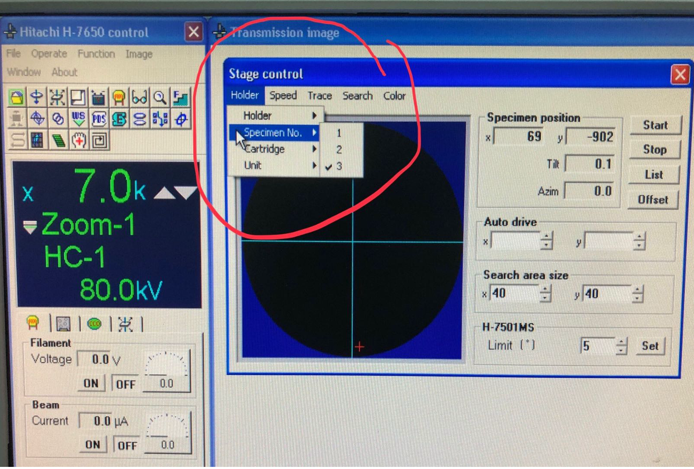
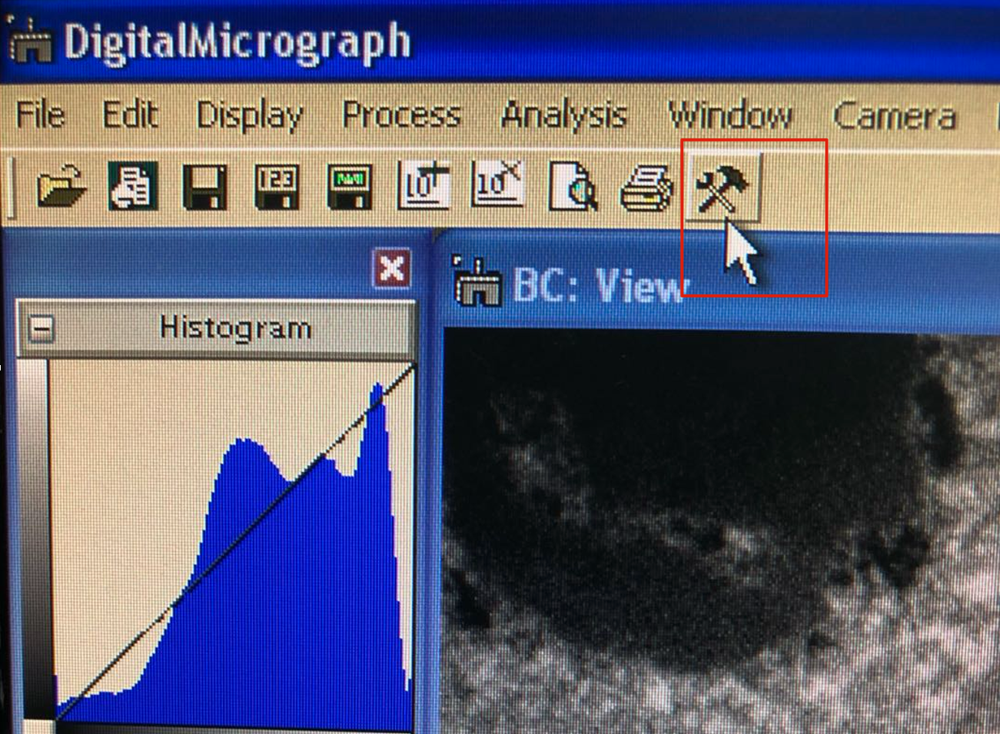
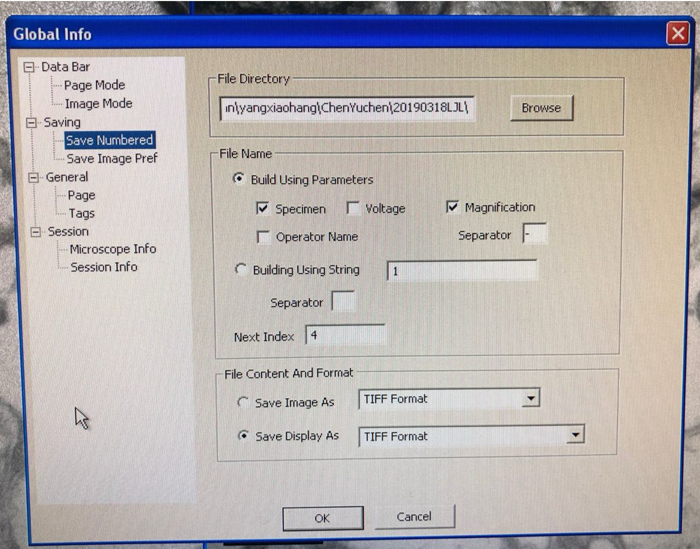
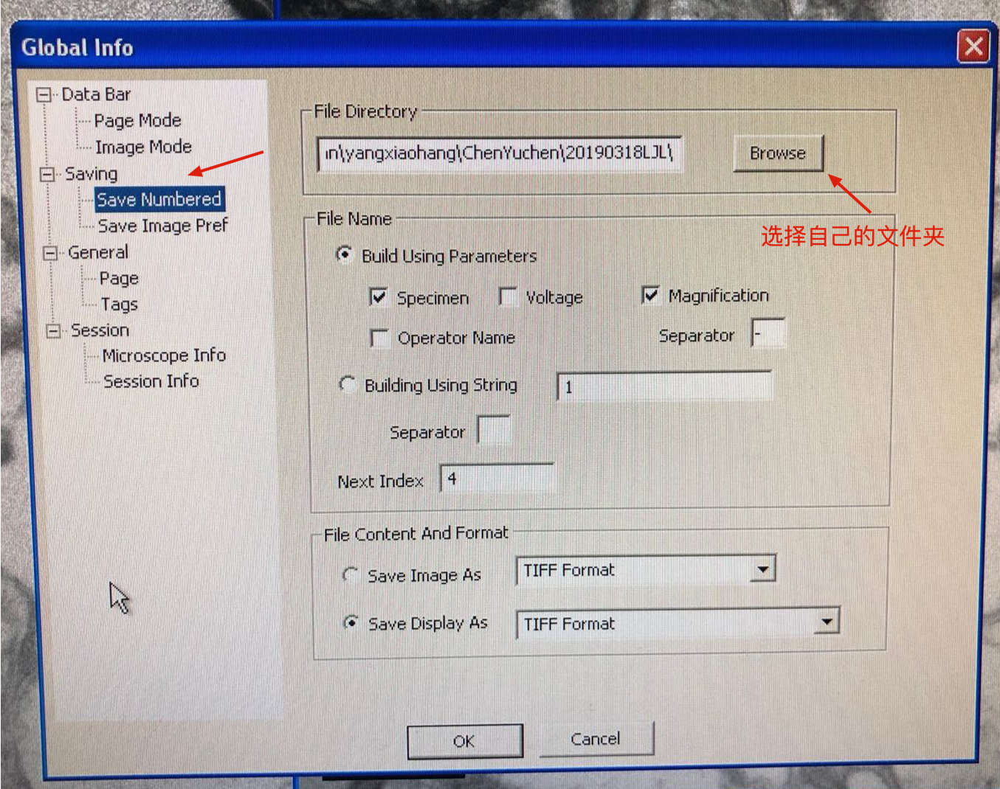
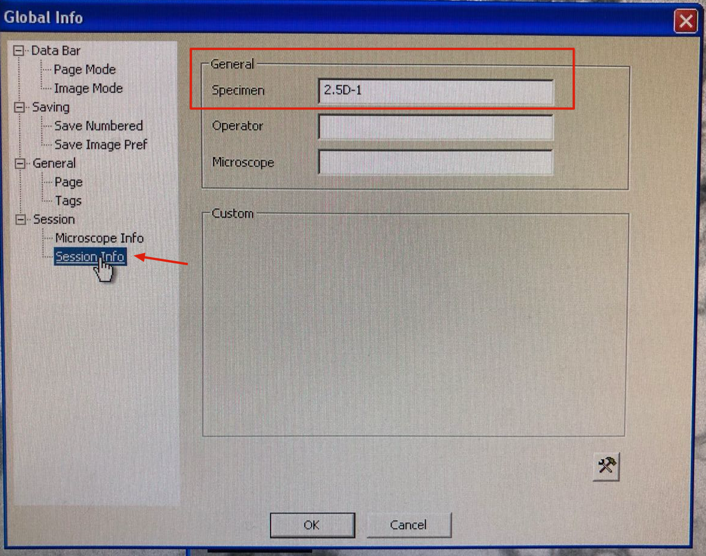
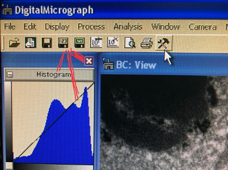
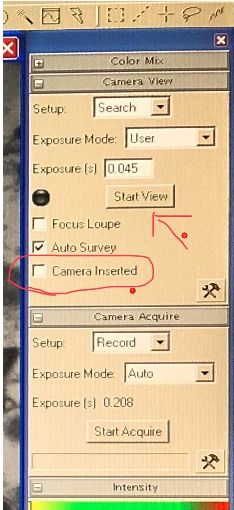
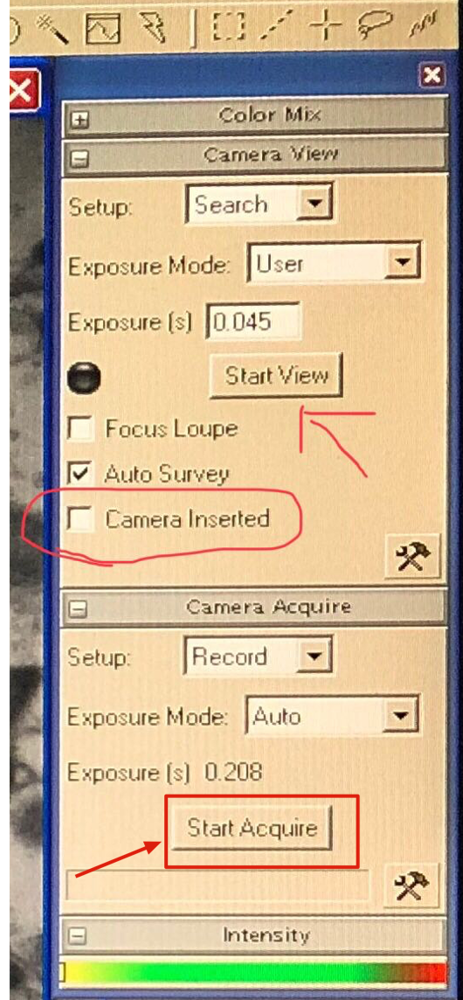
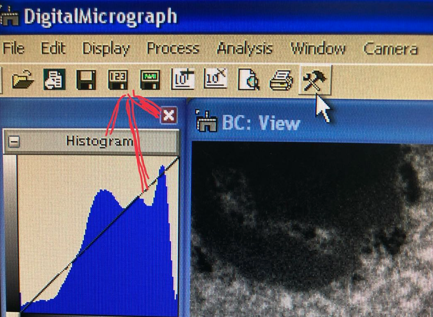



## 操作前步骤
1. 在每次操作的开始阶段，老师首先会教使用者设置照片的存盘路径（首次教学后，以后自己设置）。
2. 然后，老师将样品装进电镜并点亮灯丝（始终老师操作）。

## 基本的按钮和电脑界面
### 电镜操作所涉及的5个按钮（只有5个哦）
- 电镜左边面板有如下3按钮：
  - 1-MAG——用于调整放大倍数；
  - 2-BRIGHT——用于调整亮度；
  - 3-STAGE X——用于水平方向移动切片

- 电镜右边面板有如下2个按钮：
  - 4-STAGE Y——用于垂直方向移动切片；
  - 5-FOUS——用于调焦，使图像清晰；

### 操作台右边的电脑是电镜的电脑，仅有两处跟使用者相关
- 显示样品放大倍数，下图中7.0k表示放大7000倍，使用`1-MAG`键调节。

- 该电镜的样品杆可以一次性放进去3个样品，在“Stage control”这个窗口的“Holder”菜单下面的“Specimen No.”里面可以选择要观察的样品。
{}
在放样品时，一定要跟老师确认好样品的位置（1,2,3各自是什么样品），确保得到的图片与自己样品名是对应的。
{}

### 操作台左边的电脑是CCD（数码相机）的电脑，可以实时成像、拍照以及保存照片。
- 锤子和扳手图标，可以设置保存的相关参数。

- 点击上面图标，显示如下Global Info界面。在“**Global Info**”下面的“Save Numbered”里面可以看到保存照片路径。

{}
老师会在观察开始前教你设置好存盘路径: 
1. 我们应该在`1111nongxueyuan\fangpengxiang\`文件夹下，新建自己的个人文件夹HQY。
2. 在自己文件夹下继续新建本次实验的文件夹，例如`20231213-MGfruit`
{} 

  - 点击Browse, 选择本次实验的文件夹“20231213-MGfruit”，之后的照片都会保存在这个文件夹。

  - 此外，该页面还有一个Next Index选项，它的作用是让你的照片可以待上序号。**例如，将其设置为1，照片名字后面会从1开始命名。**

  - 在Global Info页面的Session info中，在General的Specimen中，需要填写你自己的样品名，当你在电镜的电脑里面换了样品以后，一定要记得在这里及时修改样品名称，相当于告诉CCD的软件系统：我换了一个样品了。

{}
务必注意，样品杆1-2-3三个位置，如果你选择了1号样品，则一定要将Specimen改为对应的样品名字。例如有三个样品，在样品杆的位置：1——CK，2——ERF1，3——ERF9a。如果目前你再看1号位置，则需要将Specimen改为CK。
{}

  - 当我们拍好一张照片以后，要记得存盘哦，存盘方法很简单：点击下图红色箭头所指的磁盘123即可。照片被存盘到指定的文件夹，而且照片文件名里面自动带上了样品名称、放大倍数以及序号。

- 电镜操作 👇
<iframe id="test" src="//player.bilibili.com/player.html?aid=664659916&bvid=BV16a4y197ue&cid=1364507660&p=1" scrolling="no" border="0" frameborder="no" framespacing="0" allowfullscreen="true" width=100%> </iframe>

- 样品杆装样 👇
<iframe id="sample" src="//player.bilibili.com/player.html?aid=664692234&bvid=BV1Sa4y197XJ&cid=1366928204&p=1" scrolling="no" border="0" frameborder="no" framespacing="0" allowfullscreen="true" width=100%> </iframe>

- 相机操作 👇
<iframe id="tem" src="//player.bilibili.com/player.html?aid=494699797&bvid=BV1QN411G7n5&cid=1364580181&p=1" scrolling="no" border="0" frameborder="no" framespacing="0" allowfullscreen="true" width=100%> </iframe>

- 目镜使用 👇
<iframe id="eye" src="//player.bilibili.com/player.html?aid=237208874&bvid=BV1me411y7AA&cid=1366942641&p=1" scrolling="no" border="0" frameborder="no" framespacing="0" allowfullscreen="true" width=100%> </iframe>

- 保存照片 👇
<iframe id="pic" src="//player.bilibili.com/player.html?aid=749687851&bvid=BV1dC4y1F7QP&cid=1366924726&p=1" scrolling="no" border="0" frameborder="no" framespacing="0" allowfullscreen="true" width=100%> </iframe>

## 操作电镜

{}
1. CCD作为高精密的仪器，价格昂贵（本机所配CCD，花了10万刀哦 ），而且还是易损件。所以要格外注意爱护。记住：CCD仅仅用于拍照，严禁用作浏览器！！！应在电镜里找好目标物，然后按照程序准备好以后，方能启动CCD。
2. 过高的亮度也会损伤CCD，导致其寿命缩短，所以，启动CCD之前，一定要降低亮度至昏暗的程度（但不要暗到看不到图像）。
3. 出于提高效率和保护仪器的考虑，规定生物切片样品的套餐价格里面包含观察时间半个小时以及最多10张照片。超出部分另行收费，标准为：每小时300元，每张照片10元。
{} 

### 在电镜中，用低倍找到切片，然后提高放大倍数，通过移动找到自己感兴趣的地方
注意：一张铜网上有超过3张的切片，都是当前这个样品的切片。使用者可以在一张切片上仔细搜寻，也可以在一张铜网上的不同切片里面搜寻，直到找到目标物。
### 拍照（重中之重）
找到目标物以后，拍照之前的准备工作有4大步骤：
1. 将目标对象放置在电镜荧光屏的中心附近，即靠近“十”字附近；
2. 将放大倍数调整到位。注意：设定一套倍数以后，不要随意变动！
3. 使用“Focus”，把照片调清楚。
4. 上述准备工作完成以后，将电镜里的亮度调低，达到这样的程度：电镜里的光线比较昏暗，但仍能看到图像。特别提醒：过高的亮度会损伤CCD，缩短其寿命！！！但也不要全黑了。
5. 电镜方面的准备到位以后，就要使用CCD的软件来拍照。
   - 在下图的界面中点选“Camera Inserted”，然后点击“Start View”，就会在view的窗口中看到照片预览。

{}
View窗口的作用有这样几个方面：
- 判断照片亮度是否合适（上图中的Intensity就是指示亮度，应使亮度条处于绿区范围内，红区表明亮度过高！！！）
- 判断一下所选目标物是否理想；如果目标物理想，放置是否合适（应将影响画面的因素尽量放到画面以外或放在照片的边角部位）；
- 照片是否清晰（如果不清晰，建议点击start view——再点击Camera Inserted，把CCD撤出来，在电镜里重新调焦，直至照片清晰再插入CCD）。
{}

  - 一切都调好，觉得照片是需要的。上图中，点击“Start Acquire”开始拍照（照片生成需要一段时间，请耐心等待）。

  - 获得的照片一定要及时存盘，点击磁盘123。

## 参考内容说明
{}
以上内容根据ZJU农生环电镜中心的相关资料及教学视频进行稍加整理。
{}
