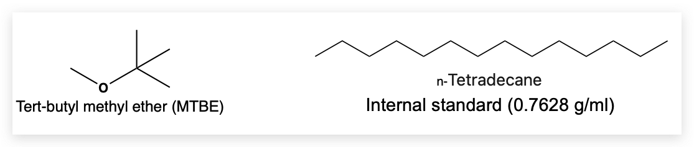

# Step1

Add 750 µl tert-butyl methyl ether (MTBE) with 7.5 µl internal standard stock solution (1 mg/ml) to each 1.5 ml microcentrifuge tube.
{}
1 mg/ml Internal standard stock solution：1.3 µl tetradecane add to 1 ml MTBE. 1.3 µl = 1 mg/ml × 1 ml÷0.7628 mg/l)
{}

- MTBE and tetradecane structure

# Step2

Cut a leaflet from the next to youngest leaf of 3-week-old plant and immerse it in extraction solution, then gently rocked for 1 min. After that, the extract was transferred to a new glass vial for GC/MS analysis. 

# Step3

GC-MS was performed to analyze the profile of volatile compounds using a 7890B network GC system with 5977B inert plus MSD detector(Agilent Technologies, https://www.agilent.com/). Quantified using a standard curve of *γ*-terpinene as the external standard.

> Schilmiller A, Shi F, Kim J, Charbonneau AL, Holmes D, Daniel Jones A, and Last RL. (2010). Mass spectrometry screening reveals widespread diversity in trichome specialized metabolites of tomato chromosomal substitution lines: Solanum trichome chemistry. The Plant Journal 62: 391–403.