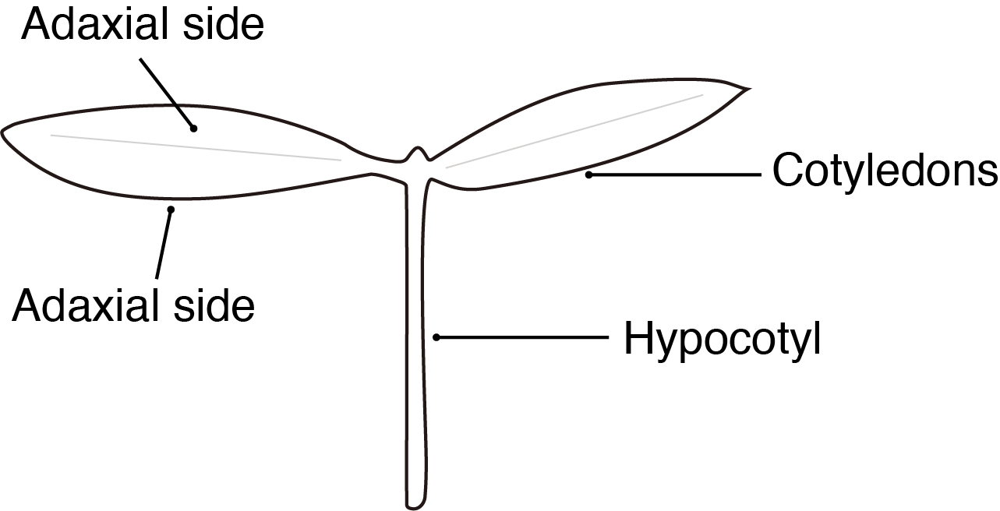

## Plant material
Tomato (Solanum lycopersicum) 生长约7-9天，两片子叶完全展开，真叶还未出现。
{}
苗期非常关键，要时刻注意苗的生长状态，否则会降低VIGS的效率。
{}

## VIGS
### DAY1
GV3101 harboring pTRV1, pTRV2, pTRV2-PDS, pTRV2-target gene are grown on LB agar plates containing 50 µg/mL of Kan and 25 µg/mL of rifampicin. Incubate at 28°C for 2 days.

### DAY3
Inoculate a 2-3 mL liquid culture of LB with the above mentioned antibiotics for each  of the strains. Shake at 28°C for 16-18 h.

### DAY4

Inoculate a 1:25 (2 ml strains: 50 ml IM)dilution of the primary culture into a secondary liquid Induction Media (IM) IM culture with kan, rif and 200 µM acetosyringone.

{}
The acetosyringone is used as an inducer of the vir genes of Agrobacterium which are required for T-DNA transfer into the plant while the IM mimics the environment this pathogen encounters in the host apoplast. Incubate by shaking at 28 °C for 20-24 h.
{}

### DAY5
1. Harvest the cells, at 3000 g for 10 min. Resuspend in the same volume that the original culture had with resuspend buffer (10 mM MgCl2, 10 mM MES pH 5.5).

2. Centrifugue for 10 min at 3000 g. Resuspend cells in 10 ml resuspend buffer, then adjust OD600=1.0. 

3. Add acetosyringone to a final concentration of 400 µM to the pTRV1 culture.

4. The different pTRV2 constructs are mixed into 50 mL conical tubes with an equal volume of pTRV1 suspension, resulting in a final acetosyringone concentration of 200 μM.

5. Individual seedlings were inoculated through the **abaxial side** of the **cotyledon**. Plants were incubated at 21-22 °C and covered to avoid light for 24 hours and returned to 16/8 h day-night cycles at the same temperature (21-22°C). Approximately 3 weeks later, the 4th true leaf of VIGS-PDS plant was observed for bleaching phenotype or sampled for qPCR assay.

## Reagents
### Prepara of Induction Medium (IM)
| V or W | Reagents                                    |
| ------ | ------------------------------------------- |
| 400 mL | ddH2O                                       |
| 4.88 g | MES (2-(4 morpholino)-ethane sulfonic acid) |
| 2.5 g  | Glucose                                     |
| 0.12 g | NaH2PO4                                     |

Note: Bring to a final volume of 475 mL with dH2O and adjust the pH to 5.6. Autoclave. After the medium has cooled down, add **25 mL** of 20X **AB salts**.

### Preparation of AB salts
| W      | Reagents   |
| ------ | ---------- |
| 20 g   | NH4Cl      |
| 6 g    | MgSO4·7H2O |
| 3 g    | KCl        |
| 0.2 g  | CaCl2      |
| 0.05 g | FeSO4·7H2O |

Bring to a final volume of 1 liter with distilled water. Autoclave. Be aware that AB salts precipitate as an orange powder. Just mix them well by swirling before their use.

### Preparation of 200 mM Acetosyringone. Please note that acetosyringone should be prepared the day it will be used
| W       | Reagents                                                 |
| ------- | -------------------------------------------------------- |
| 19.6 mg | Acetosyringone (3’, 5’-Dimethoxy-4’-hydroxyacetophenone) |
| 500 µL  | DMSO (Dimethyl sulfoxide)                                |

## References
André C. Velásquez, Suma Chakravarthy, Gregory B. Martin. Virus-induced Gene Silencing (VIGS) in *Nicotiana benthamiana* and Tomato. Journal of Visualized Experiments. 2009. 1292 doi:10.3791/1292 

