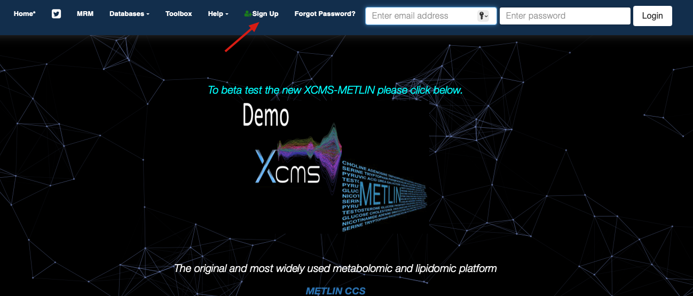
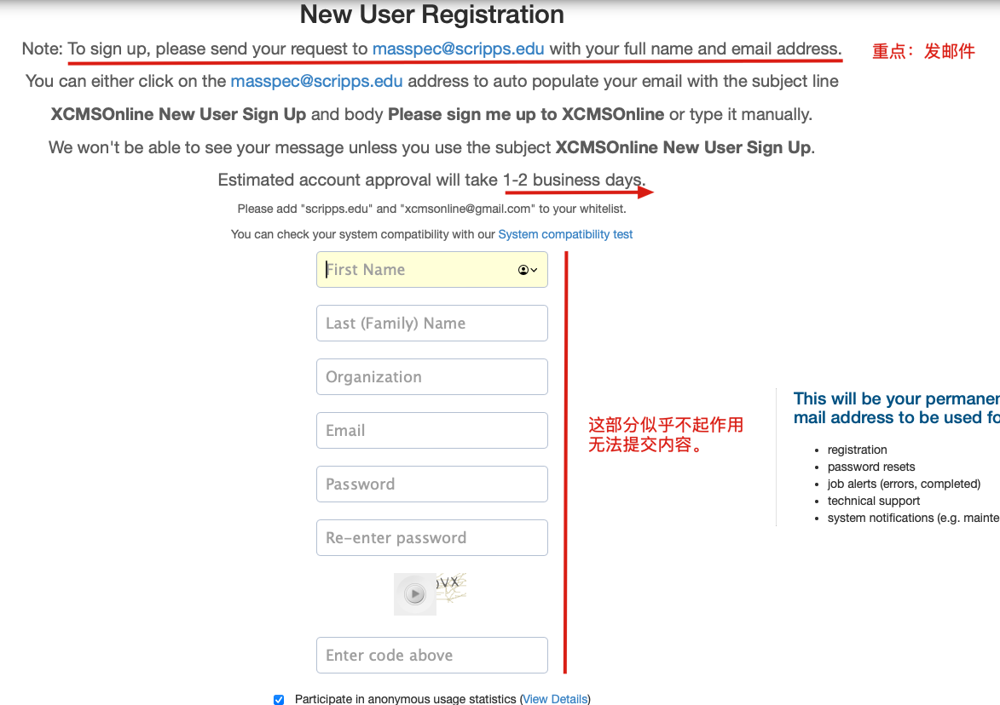
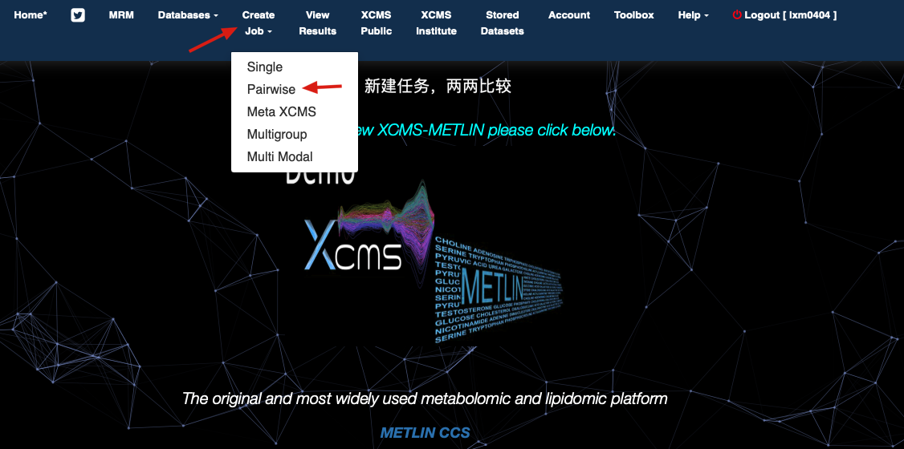
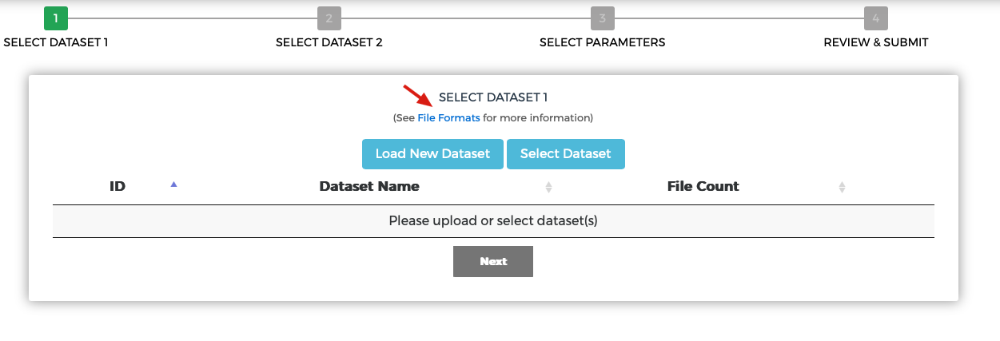
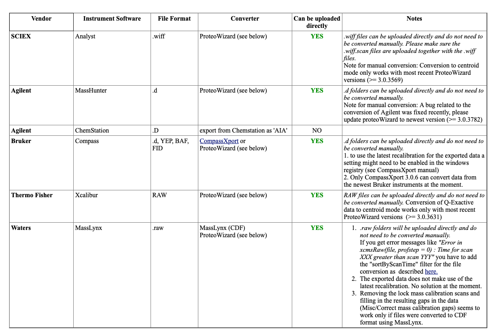
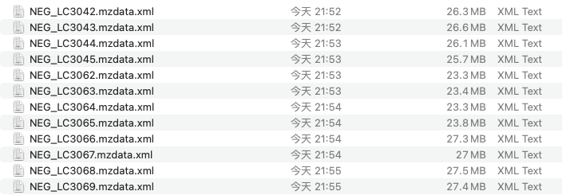
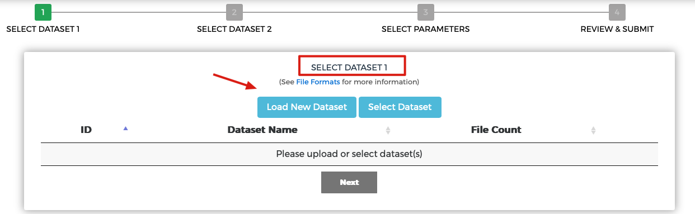
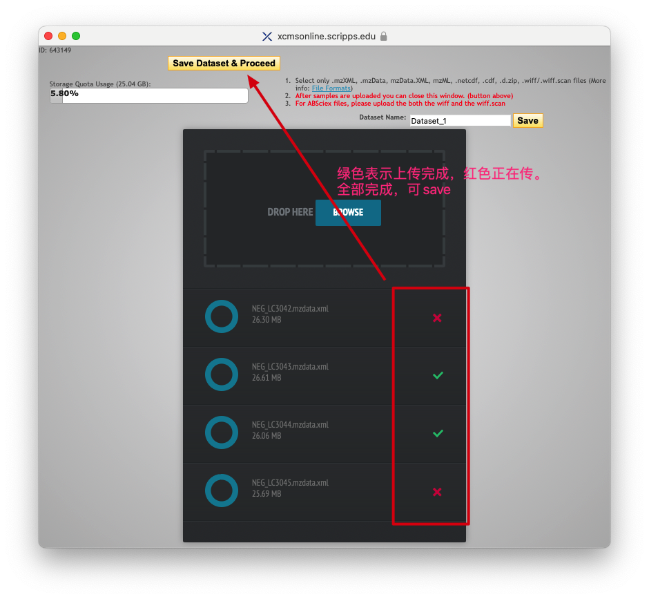

## 注册XCMS网站
网址：[https://xcmsonline.scripps.edu/landing_page.php?pgcontent=mainPage](https://xcmsonline.scripps.edu/landing_page.php?pgcontent=mainPage)
{}
最好使用edu的邮箱，否则不好注册。
{}

## 新建任务

- 查看可之间上传的文件格式

## 可上传的数据格式
若不满足以下数据格式，可使用[ProteoWizard](http://proteowizard.sourceforge.net/downloads.shtml)进行转换。

Ailgent的数据格式`.d`需要进行转换，通常可以将其转换为`.mzxml`。否则是无法整个上传，会将文件夹中的所有文件分开上传。转换后数据如下：

{}
转换方法详情见文章[MSconvert](https://lxmic.netlify.app/post/msconvert/)
{}
## 上传需要比较的文件
### 先上传对照组，生物学重复一起上传

上传了数据集1共4个文件,点击next
