## 修改现有样式——创建适合PPT文献引用格式
1. [open CSL editor site](https://editor.citationstyles.org/about/)，可再搜索框搜索需要修改的期刊文献引用格式。
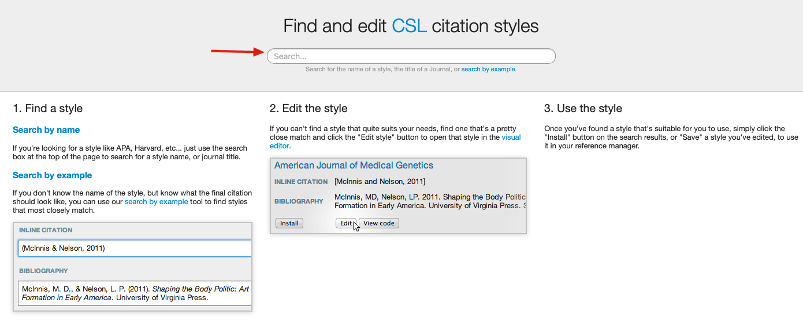

2. 例如Nature，点击Edit进行修改。
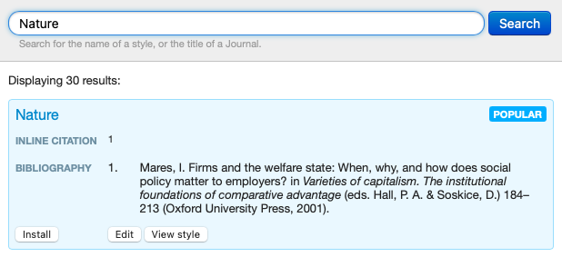

3. 进入visual editor界面。
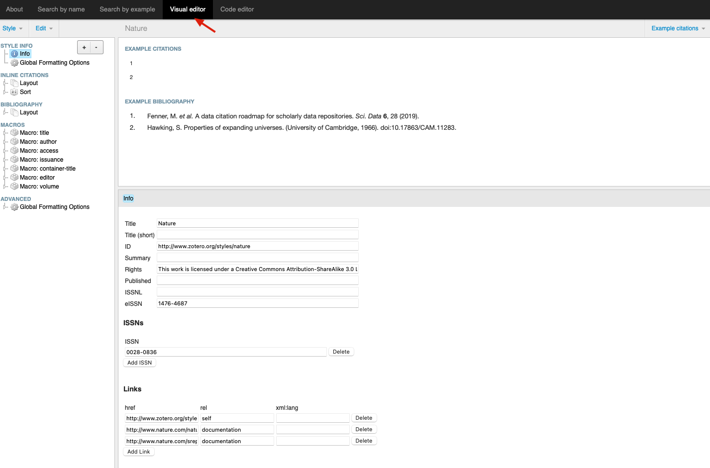

4. 点击Example citations,将例子选择成我们熟悉的**journal article**，否则修改的内容可能让你有点晕。
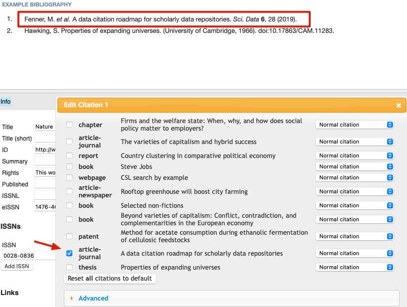

5. INLINE CITATIONS可以将其删除，PPT引用不需要。删除后，显示[NO_PRINTED_FORM]。
{}
需要注意的是，这里的Layout和Sort内容不能删除，只能删除他们包含的内容（就是下拉菜单内容）。
{}
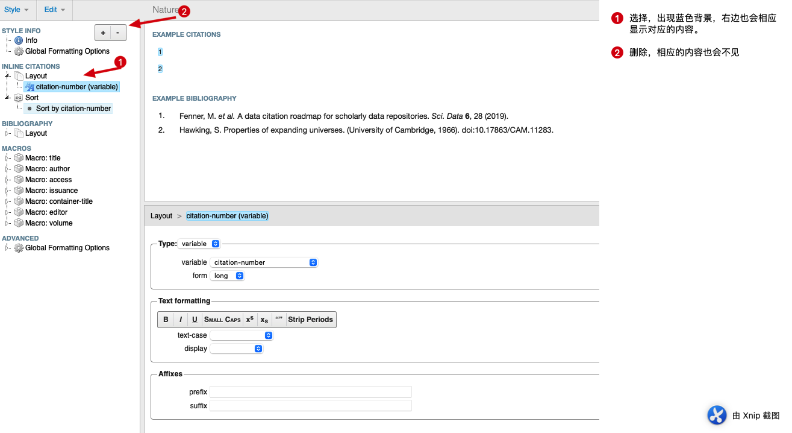
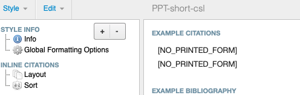

6. 删除number以及title，基本上不太需要这两个内容。
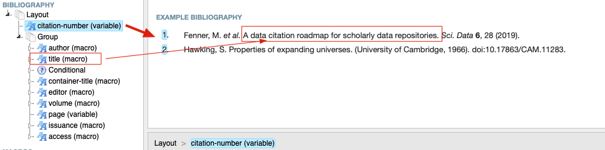

7. 此时已经是比较短的引用了，你可以再稍做调整，可以将名字显示更短，或者将年份去掉括号，调整至volume前面，可以取消volume的加粗，可以将期刊名显示完整，或者改变分割符号。
 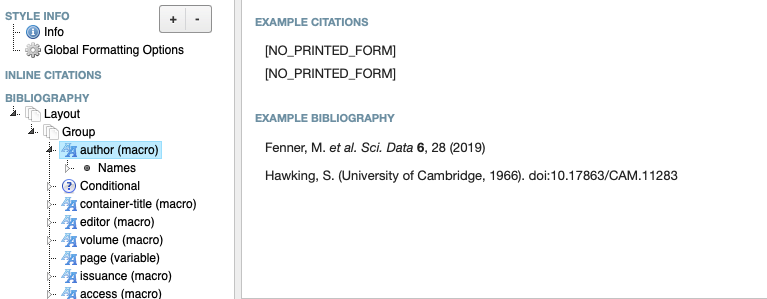
8. 我自己引用的样式如下，可以进行一步步调整，达到这个效果。
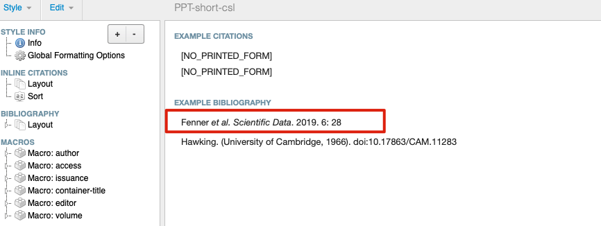
9. 比如我要修改名字的长短，点击名字，会出现可以编辑的位置，其中Name部分有**form**，选择short，就会缩短名字。其他部分内容也是一样的修改，具体的参数可以自己研究一下。
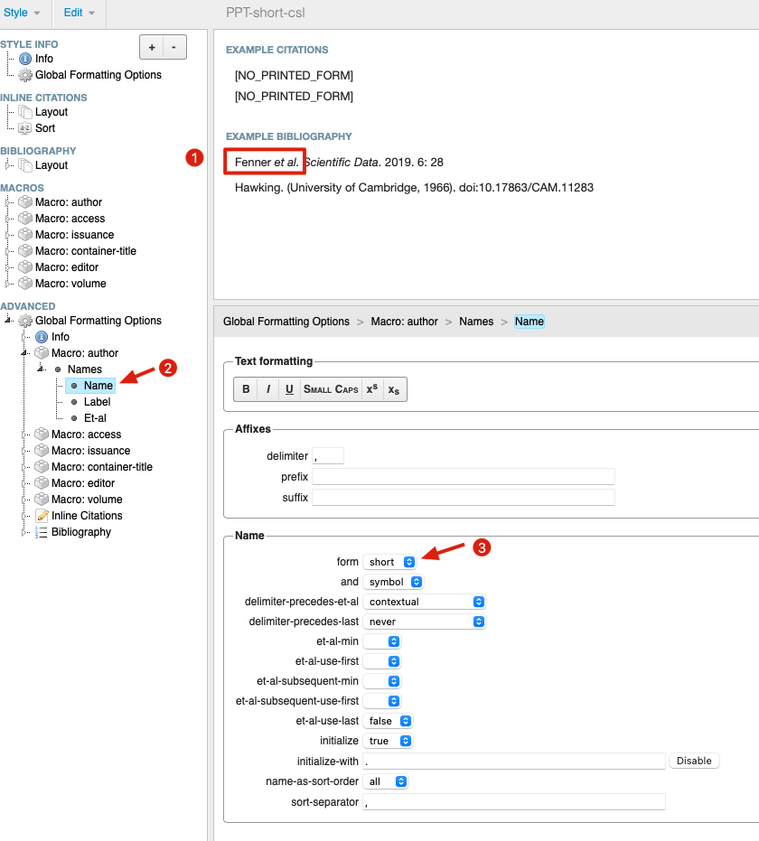
10. 最后修改CSL的名字，自己像个名字填入title，并删除ISSN号。
点击**ADVANCED**-info，在title部分填入自己想要的名字，再点击Delete删除ISSN号，至此全部修改完成。
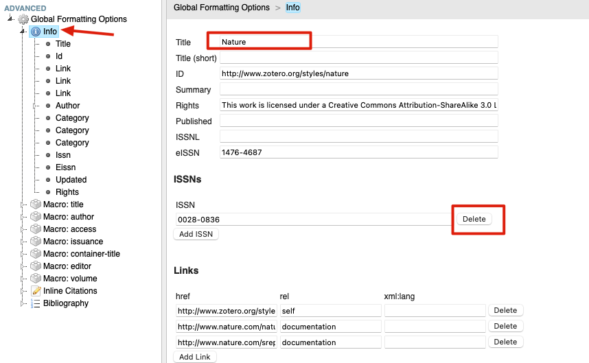
## 保存修改后的CSL文件，导入Zotero中使用
- 点击左上角的Style，点击Save style
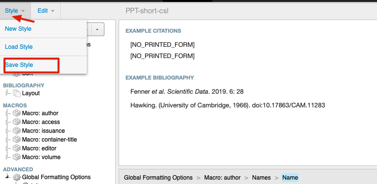
- 点击download style
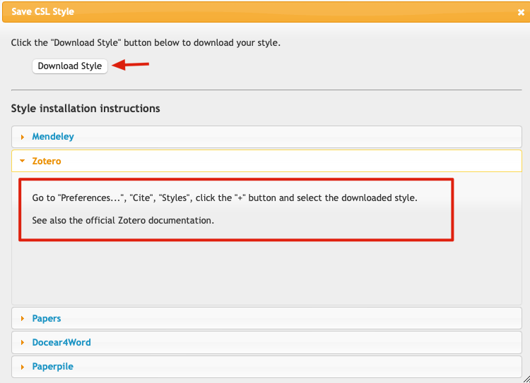
- 根据Zotero这部分说明，将CSL文件导入zotero，然后选择该引用方式。
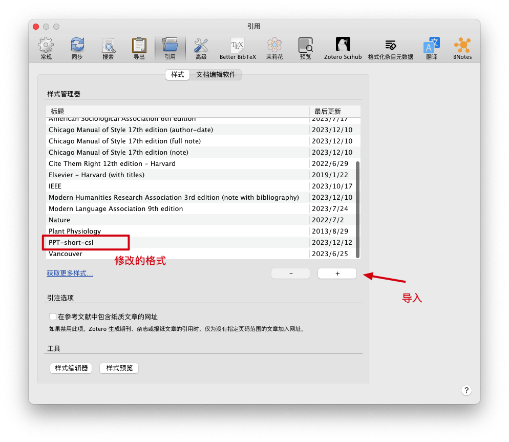
## 参考内容
1. [知乎@兰斯《Zotero + CSL编辑器，自定义文献引用格式，创建PPT中的短文献引用》](https://zhuanlan.zhihu.com/p/185026280)
2. [Visual CSL Editor: A guide to modifying and creating citation styles in Mendeley and Zotero](https://www.researchgate.net/publication/359256507_Visual_CSL_Editor_A_guide_to_modifying_and_creating_citation_styles_in_Mendeley_and_Zotero)

<embed src="VisualCSLEditorGuide.pdf" width="700" height="650">
s